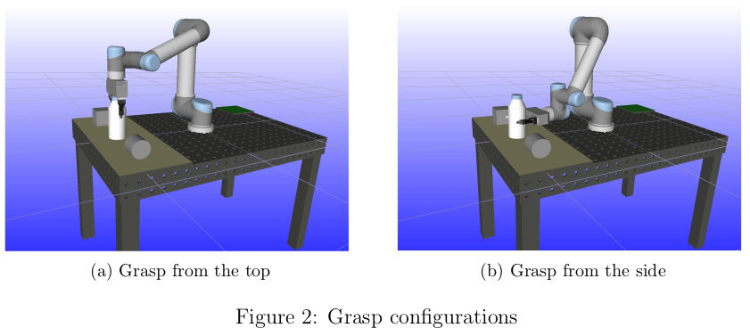
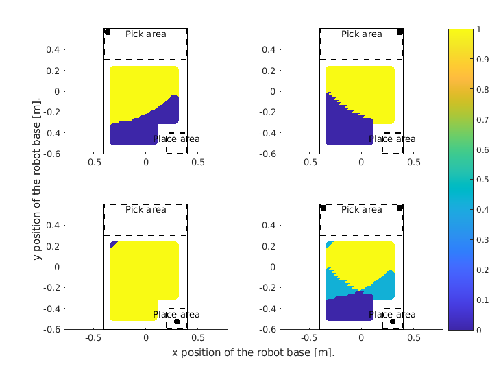
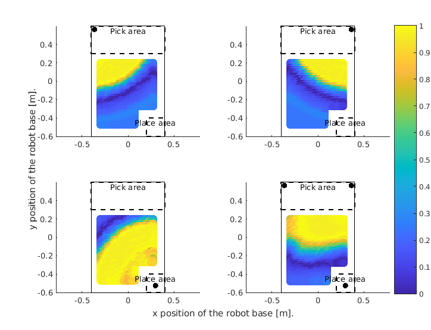
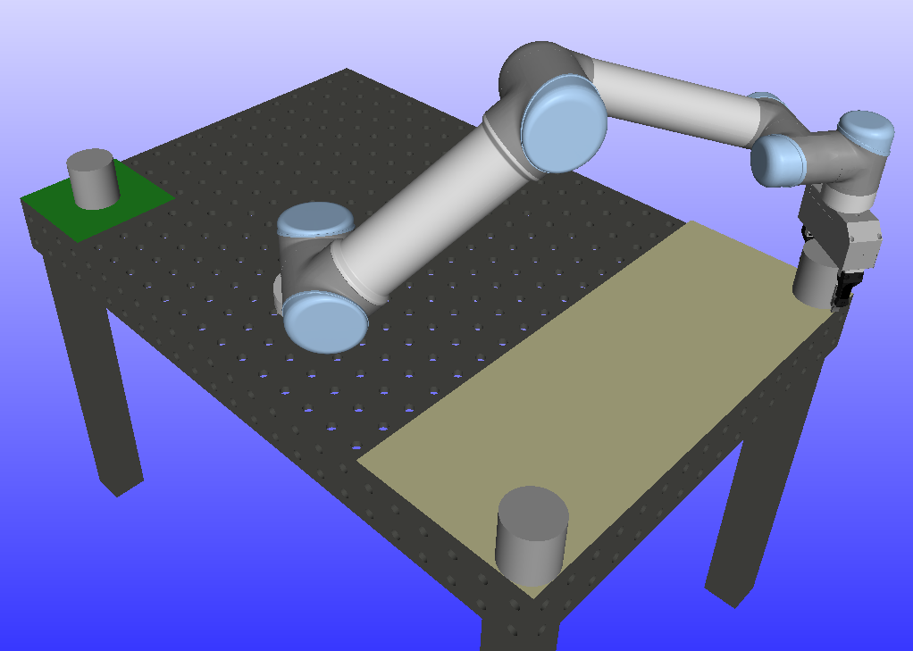
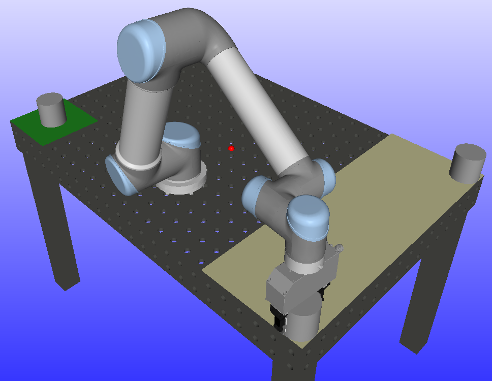
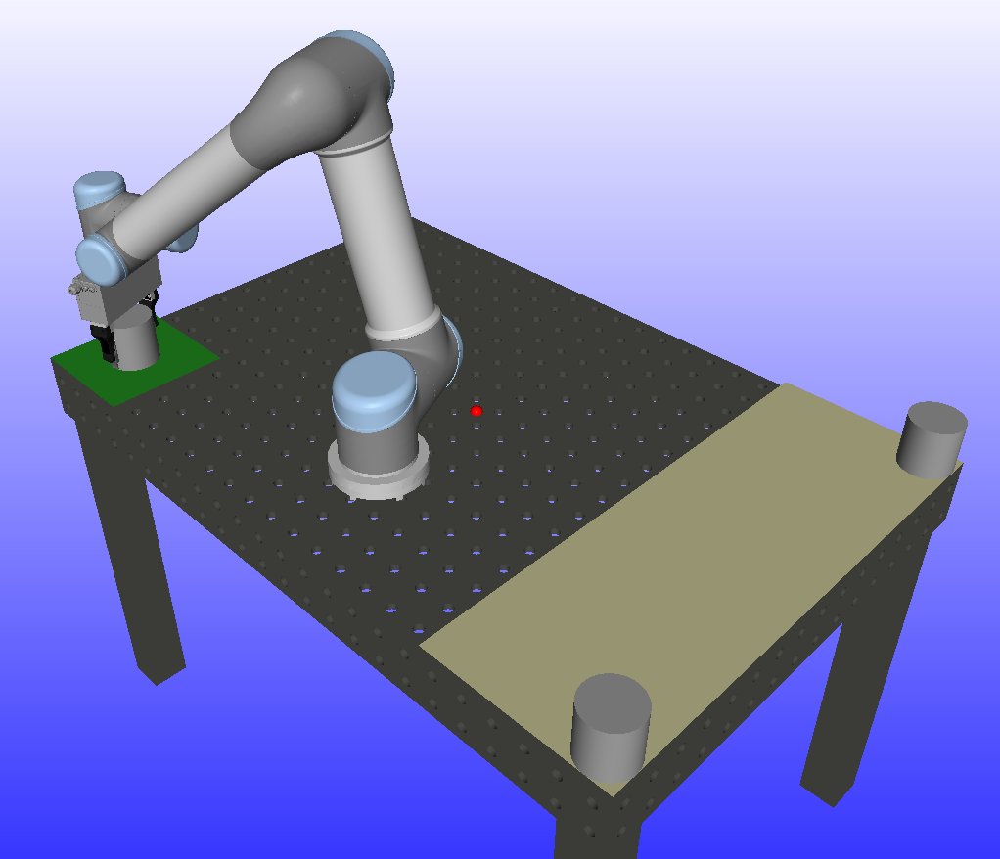
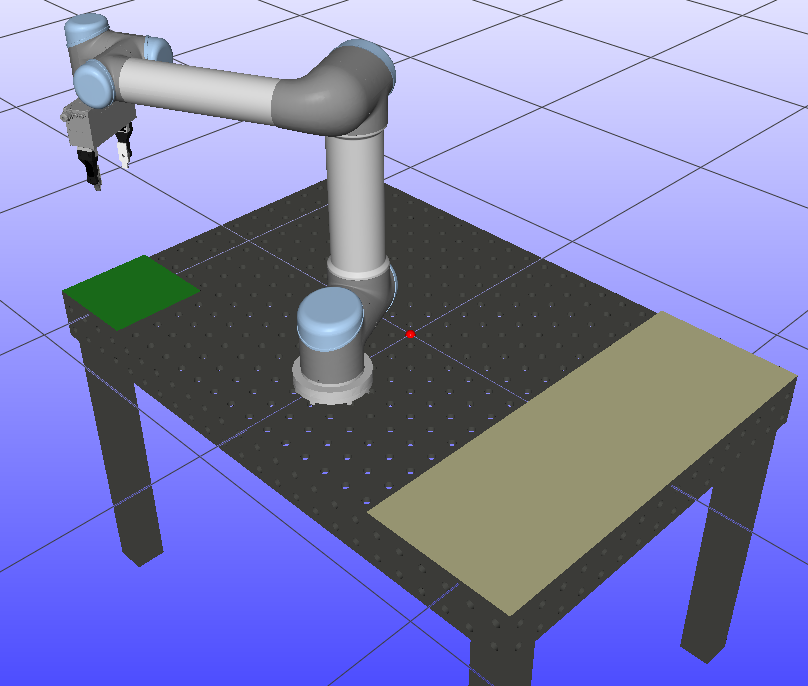

# Reachability Analysis for the Design of the Robot Workcell

This folder contains the code for the reachability analysis.

## Task description

Similar as in programming exercise 5, you are asked to determine the best mounting position (base position), so that the robot can reach both the pick and place locations in the scene with as many collision free kinematic configurations as possible. Requirements:

- Consider two grasping possibilities, from the top (see Fig. 2 a ) and from the side (see Fig. 2 b).



- Perform the study based on 30 - 60 different mounting positions for each grasping possibility, you can also vary the position of the object - it does not have to be static.
- The results should be presented in a graphical form (preferably with reachability areas), and statistical evaluation (graph representing the relation between moving the base and number of collision free representations.)

After you conclude the study, pick the best location and give a description why this is the best position.

## Code

The source code for generating the data to [cylinder_side](cylinder_side) and [cylinder_top](cylinder_top) is located in [source code](src/main.cpp). To run the project go to the folder [build](src/build) and run:

```cmake
cmake ..
make
./reachability_analysis
```

## Results

The figures shown are contain in [figures](figures).

### Cylinder grap from the top



### Cylindere grap from the side



### Choosen position of the robot





### Home position


